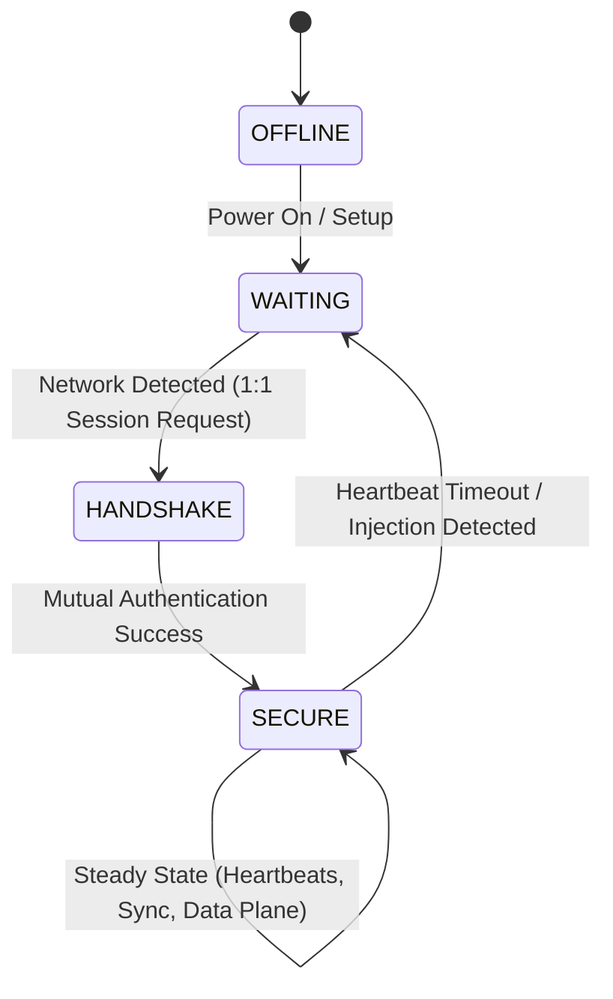

# SPSEC Participant

This repository contains the main application logic for a node running the SPsec protocol. It ties together the platform abstraction, the core CAN mapping, and the underlying crypto to form a fully functional secure communication proxy.

The participant realizes the abstract roles defined by SPsec, primarily standard Participant behavior and optionally the Sync Role (providing the canonical 64-bit timestamp for the network). It is responsible for actively orchestrating the separation of the Internal and External Control Planes from the Data Plane.

## State Machine Architecture

The Participant operates around a strict lifecycle ensuring no unauthenticated data plane traffic is allowed onto the secure network.

## Key Responsibilities

### 1. Control Plane Management
- **External Control Plane**: Generating and processing over-the-wire management frames such as Time Synchronization broadcasts (if acting as the Sync Role) and Secure Heartbeats (`session_heartbeat.c`, `session_timesync.c`).
- **Internal Control Plane**: Feeding alerts (like injection detection) or operational status up to the host application or proxy layer.

### 2. Session Orchestration
Manages the `HANDSHAKE` phase logic by coordinating the message exchanges required to derive Session keys and achieve mutual authentication before progressing to the `SECURE` state (`session_handshake.c`).

### 3. Data Plane Forwarding
Once in the `SECURE` state (`session_loop_secure.c`), it is responsible for intercepting raw input CAN frames, passing them to the Crypto layer to attach Uniqueness value and the Security Stamp, and sending them onto the secure network channel.

### 4. Dynamic Register Operations
Exposes the SPsec configuration (e.g. updating keys) over the network via a mapped register protocol. Logic includes bounds checking, validation, and segmentation of large payloads (`register_read_init.c`, `register_write_apply.c`).